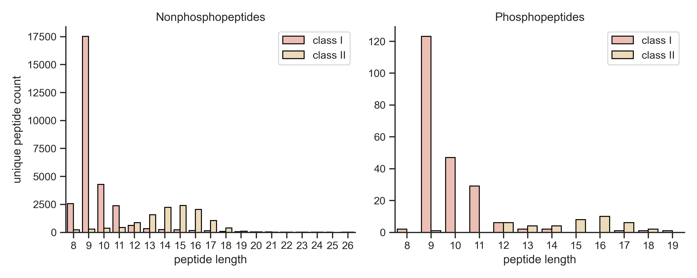
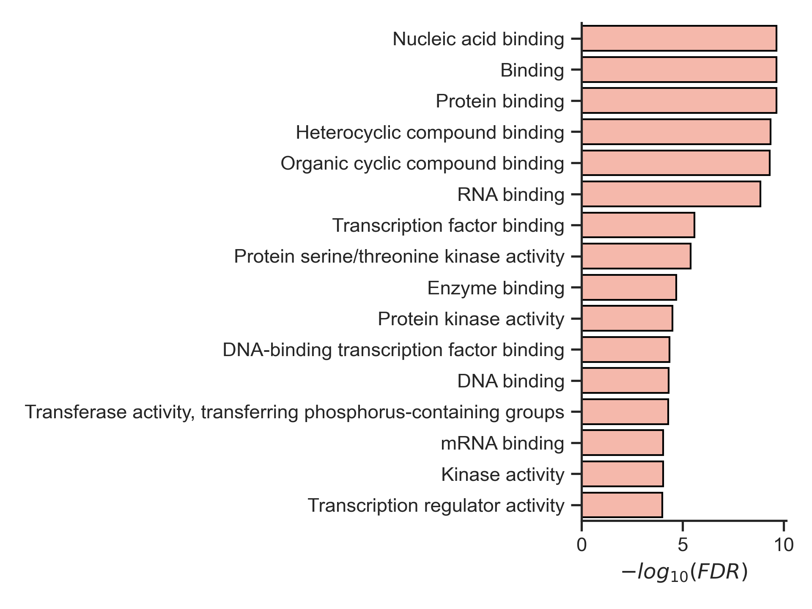
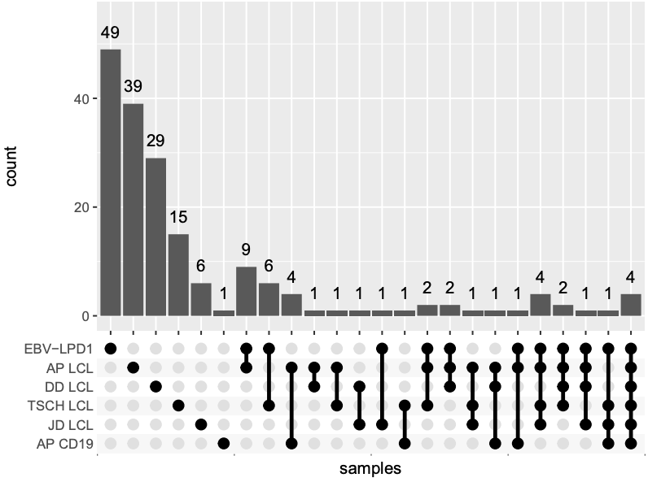
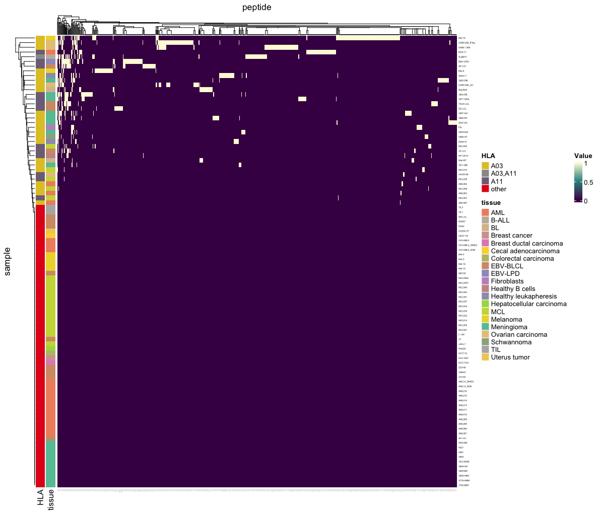
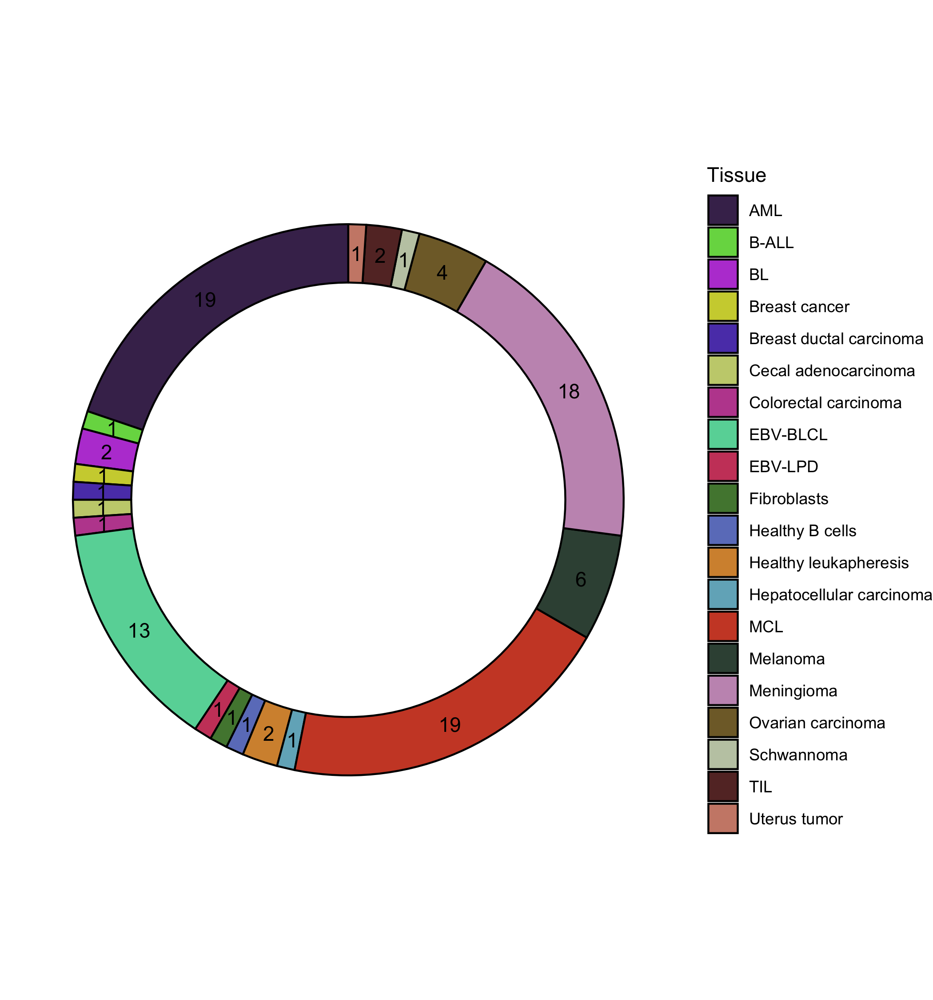

# immunopeptidomics
Data parsing, analysis, and visualization scripts for HLA ligand datasets with a particular focus on phosphorylated peptides. These scripts were used to perform the analysis described in [Molvi et al. bioRxiv (2023).](https://doi.org/10.1101/2023.02.08.527552)

## Manifest

`ParseAndFilter.py`: Parse, filter, and export pandas dataframe of BYonic search results from LC-MS/MS experiments.

`summaryPlots.py`: Create count plots of unique peptides in each sample and their length distributions. 

`GO_plot.py`
Plot GO term analysis

`peptidome_UpSetPlot.R`: Set intersection analysis of phosphopeptides between tissue samples

`peptide_heatmap.R`: Unsupervised hierarchical clustering of  peptides shared between samples.

`tissue_donutChart.R`: Donut chart to visualize tissue representation in dataset.

